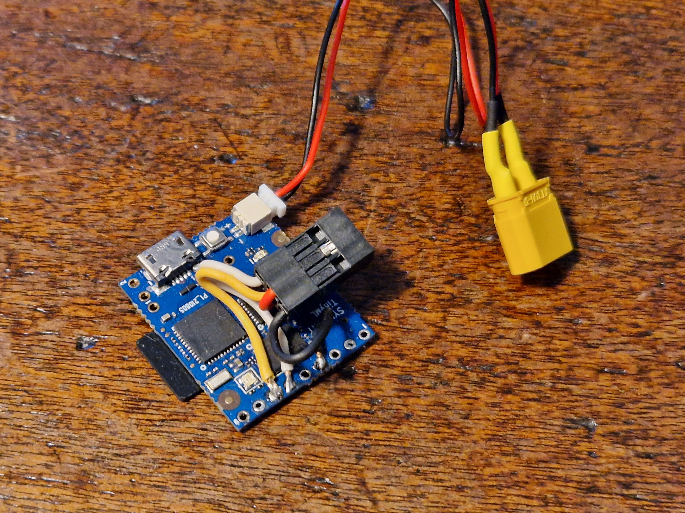
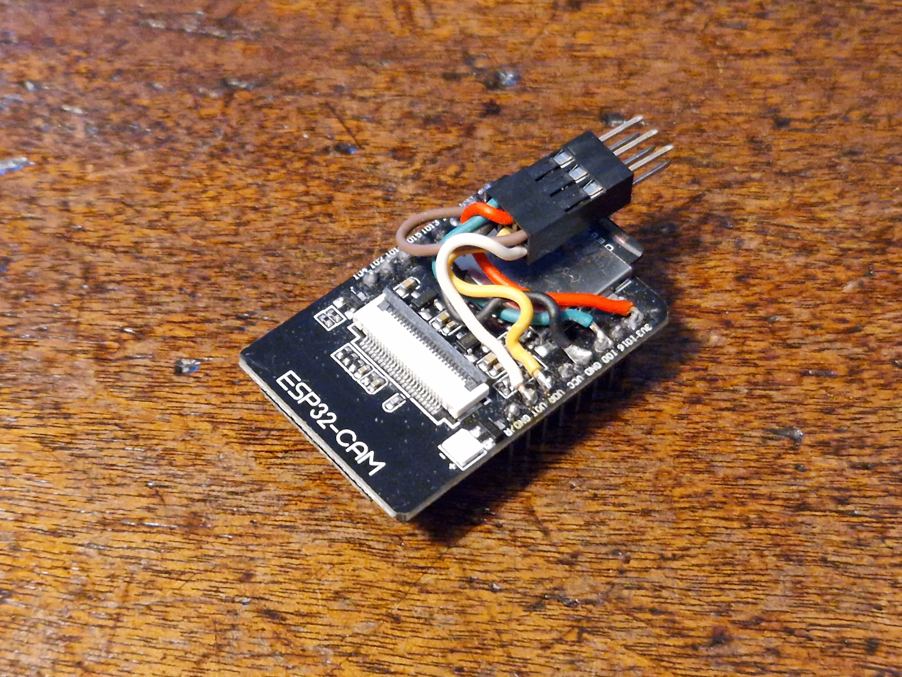
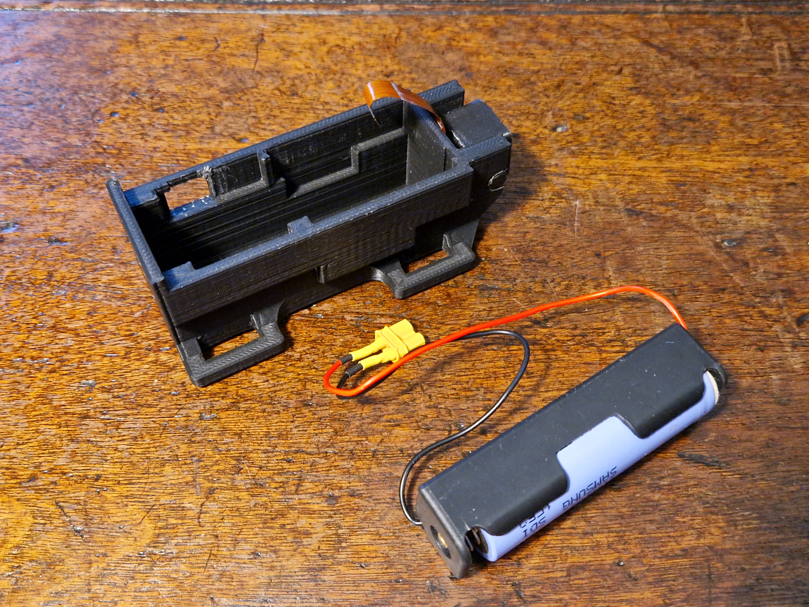
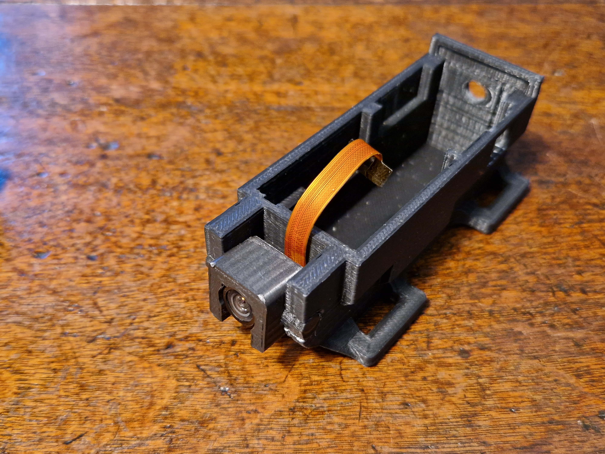
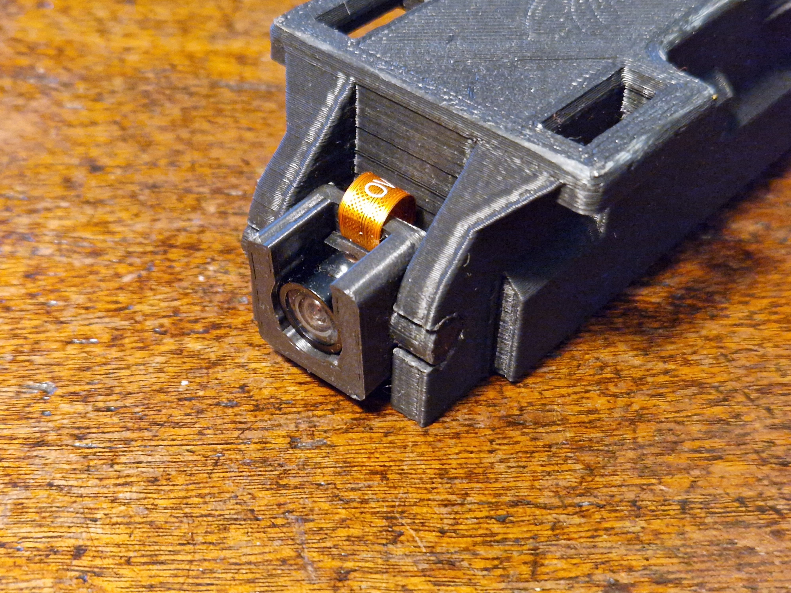
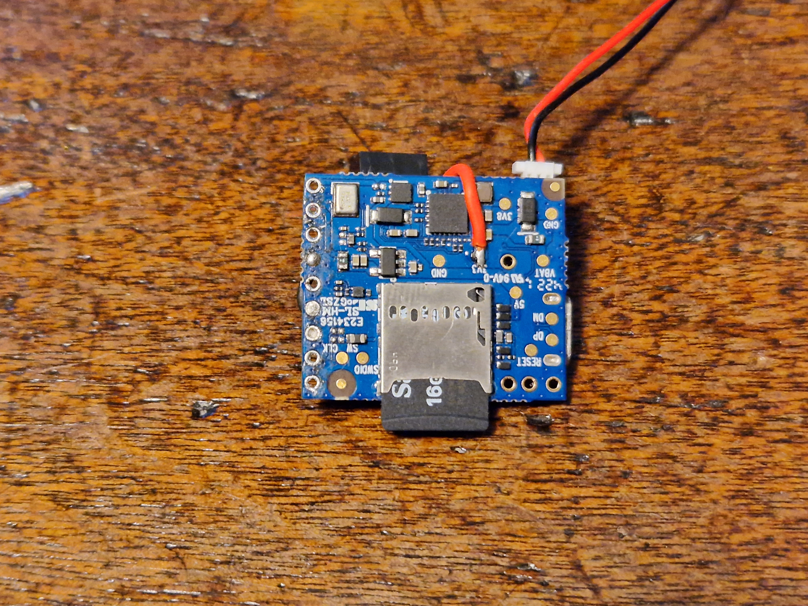
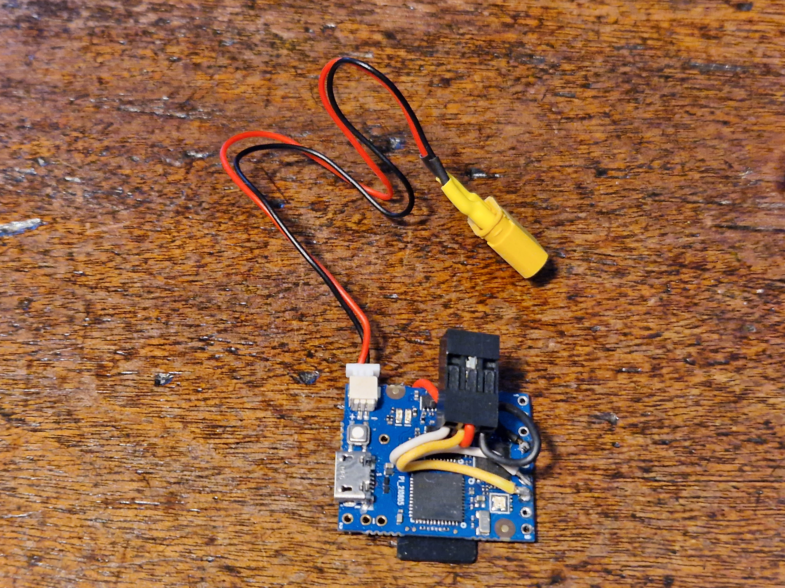

# RAT-TinyML-record
 RAT TinyML backpack code. recording only
 
 This is the code for the Syntiant TinyML board
 
 The base code for logging accelerometer data has been modified to communicate with an ESP32 over the 2nd serial port (pins 6 and 7). The TinyMl can communicate messages to the ESP32 which will then be forwarded to the user on the viewing webpage
 Whenever the ESP32 receives a time update(either from NPT server or the browser) it sends a message to the TinyML to update the RTC so that both systems will end up with synchronously time stamped log files.

6 pin connections betwixt ESP32 and TinyML board. (Dupont 3x2 connector, pins on ESP32 side) 
_|_  
---|---
5V (Brown)|Tx (White)
3V3 (Red)|Rx (Yellow)
IO0 (Green)|GND (Black)

5V and IO0 are used for programming. 3V3 is used in the backpack and takes power from the 3V3 test pad on the TinyML.

Battery is an 18650 in a holder. A smaller cell would make everything smaller and lighter, this is what was to hand. Battery connector is an Amass XT30.

Camera is an OV2640 wide andgle on a 75mm flexi.

ESP32 code: https://github.com/binraker/RAT-ESP32

CAD for case: https://gallery.autodesk.com/projects/169803/camerawifiai-platform

The next step is to gather some data and train the ML modle. The TinyML will then generate a message when it detects something in the accelerometer data-stream that looks like an action we have labelled
# Building one:
Bits that are needed:

Item|Manufacturer|Example listing
---|---|---
ESP32 CAM |AI Thinker
u.FL to SMA cable|
SMA 2.4GHz antenna| | [Can get the preceding in a kit]([https://tinyurl.com/RatPackKit](https://www.amazon.com/Aideepen-Bluetooth-Camera-Dual-Band-Antenna/dp/B08GKLWCB7/ref=sr_1_9?crid=8T8813N2QFHB&keywords=esp32%2Bcam&qid=1660421773&sprefix=esp32cam%2Caps%2C139&sr=8-9&th=1))
OV2640 wide   on a 75mm| | https://tinyurl.com/75mmOV2640
TinyML |Syntiant | https://tinyurl.com/TinyMLDigikey
18650 Li-ion Cell|
186050 holder|
1mm JST 2 pin connector|
XT30 connector pair| Amass
2x3 DuPont connecotr pair and pins |DuPont
USB to Serial adaptor (for ESP32 programming) |

Images of the hardware

