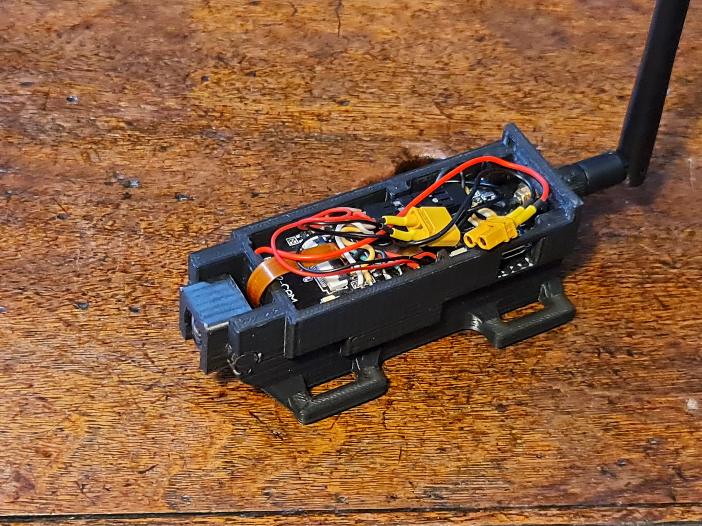
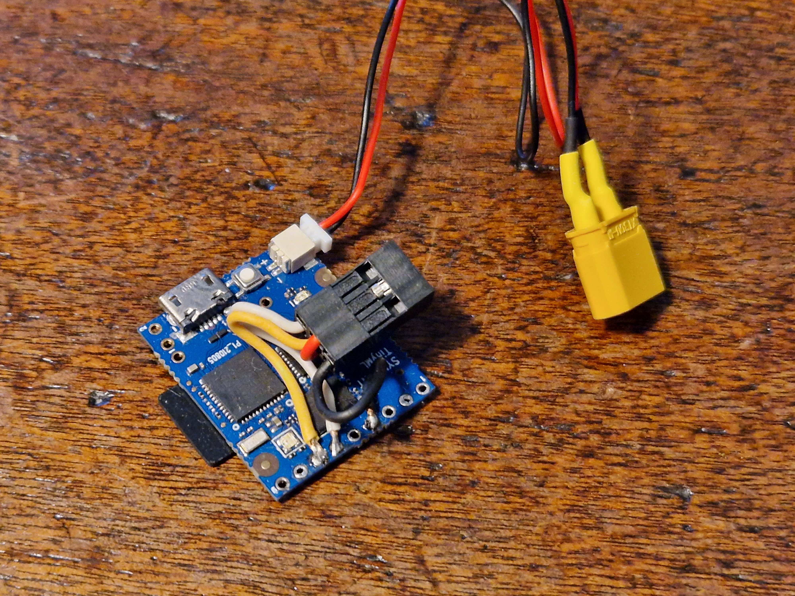
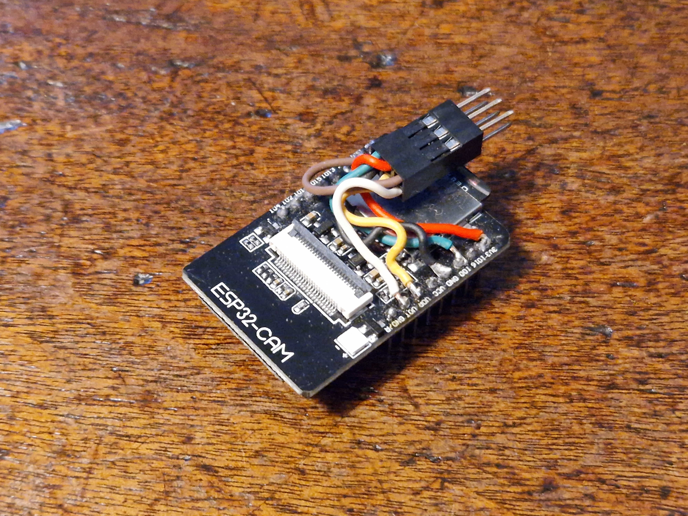
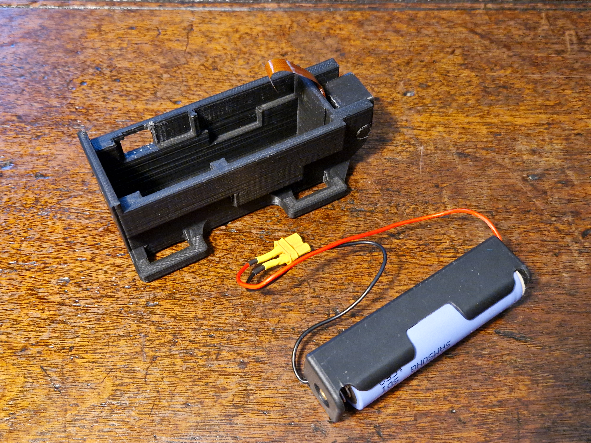
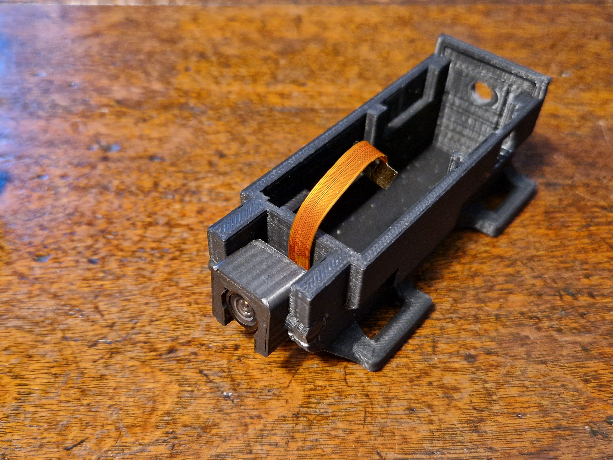
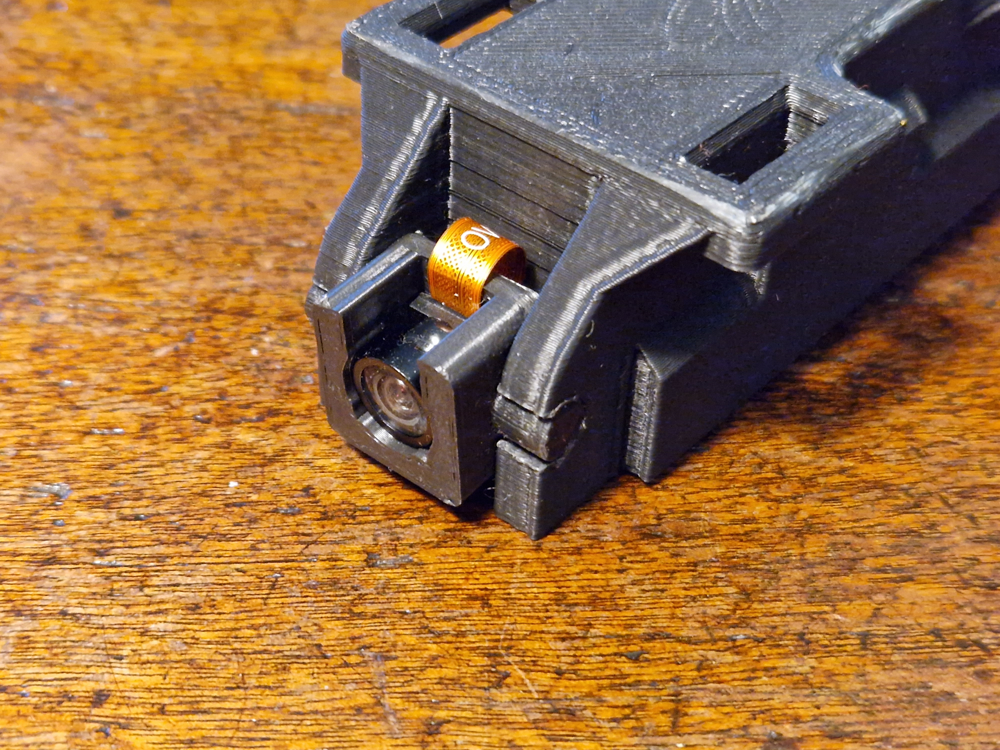
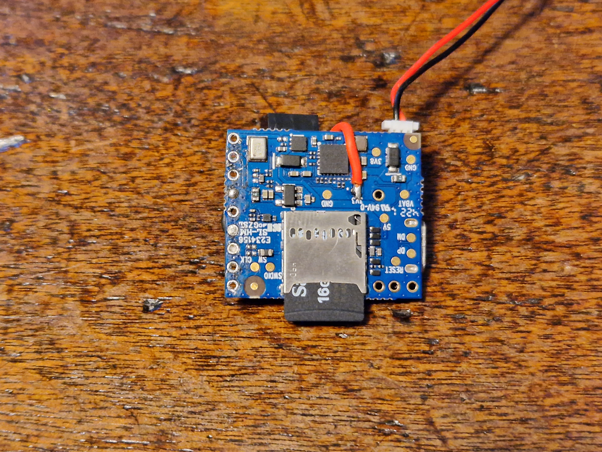
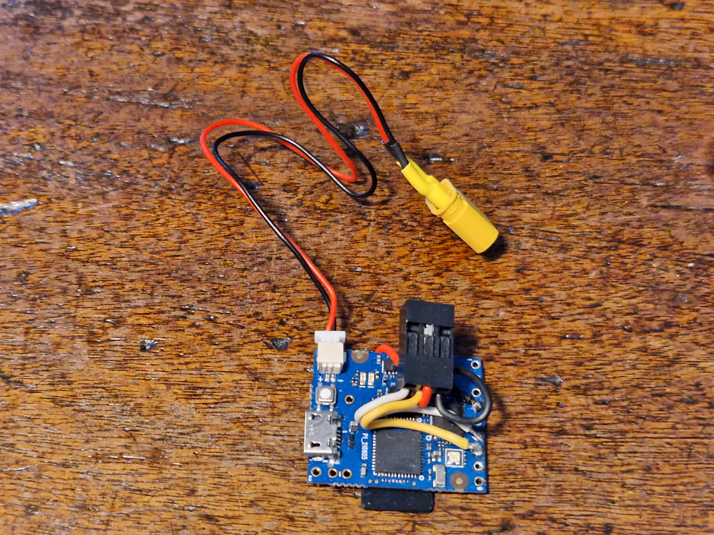

# RAT-TinyML-record
 RAT TinyML backpack code. recording only
 
 [for TODO list see here](/TODO.md) 
 
 This is the code for the Syntiant TinyML board
 
 The base code for logging accelerometer data has been modified to communicate with an ESP32 over the 2nd serial port (pins 6 and 7). The TinyMl can communicate messages to the ESP32 which will then be forwarded to the user on the viewing webpage
 Whenever the ESP32 receives a time update(either from NPT server or the browser) it sends a message to the TinyML to update the RTC so that both systems will end up with synchronously time stamped log files.

6 pin connections betwixt ESP32 and TinyML board. (Dupont 3x2 connector, pins on ESP32 side) 
_|_  
---|---
5V (Brown)|Tx (White)
3V3 (Red)|Rx (Yellow)
IO0 (Green)|GND (Black)

5V and IO0 are used for programming. 3V3 is used in the backpack and takes power from the 3V3 test pad on the TinyML.

Battery is an 18650 in a holder. A smaller cell would make everything smaller and lighter, this is what was to hand. Battery connector is an Amass XT30.

Camera is an OV2640 wide andgle on a 75mm flexi.

ESP32 code: https://github.com/binraker/RAT-ESP32

CAD for case: https://gallery.autodesk.com/projects/169803/camerawifiai-platform

To get the data from the sensor we need to load a model into the AI processor. to do this simple coppy the file sensor_data_collection_model.bin from the sensor_data_collection_model folder onto the SD card that you put into the tinyML board and it will read it on power up.

The next step is to gather some data and train the ML modle. The TinyML will then generate a message when it detects something in the accelerometer data-stream that looks like an action we have labelled

## Installation Steps

### Windows only:
### Download the Executable
The executable file for this project is automatically built using GitHub Actions whenever there's a push or pull request to the main branch. To download the latest version of the executable:

Go to the Actions tab in the GitHub repository.
Click on the latest successful workflow run.
Under the Artifacts section, find the windows-executable artifact.
Click on it to download a zip file containing the .exe file.

### Running the Executable
After downloading, extract the zip file to obtain the run_installer.exe file. Before running the executable, ensure that your system is connected to the necessary hardware, such as the ESP32, TinyML board, and an SD card reader.

Steps to run the executable:

Connect your ESP32 and TinyML board as described in the project documentation.
Ensure the battery, camera, and other hardware components are correctly installed and connected.
Insert the SD card into your SD card reader.
Double-click on run_installer.exe to run the installer. The installer will perform various tasks, including detecting the SD card, setting up board ports, and copying necessary files.
Follow any on-screen instructions or prompts to complete the installation process.
Note: The executable is designed to run on Windows. If you are using a different operating system, you may need to follow alternative installation steps as described in other sections of this document.

### Run the Installer: 
Use the provided Python script to automate the setup process. This script will execute a shell script to handle various setup tasks.

Note: The installer script will try to guess the TinyML board's serial port. This can be typically be found in the Arduino IDE under Tools > Port. The port will be in the format /dev/cu.usbserial-XXXXXX on macOS and /dev/ttyUSBX on Linux. If yours is different, you will need to manually edit the installer script.

python run_installer.py

### Manual Checks: 
After running the installer, ensure the following:

The ESP32 and TinyML board are connected as per the project documentation.
The battery, camera, and other hardware components are correctly installed.
The 'sensor_data_collection_model.bin' file is manually copied to the SD card for the TinyML board.
### Automated Setup: 
The installer.sh script will handle:

Compiling and flashing firmware to the ESP32 and TinyML board.
Configuring additional project-specific settings.

# Building the hardware:
Bits that are needed:

Item|Manufacturer|Example listing
---|---|---
ESP32 CAM |AI Thinker
u.FL to SMA cable|
SMA 2.4GHz antenna| | https://tinyurl.com/RatPackKit
OV2640 wide   on a 75mm| | https://tinyurl.com/75mmOV2640
TinyML |Syntiant | https://tinyurl.com/TinyMLDigikey
18650 Li-ion Cell|
186050 holder|
1mm JST 2 pin connector|
XT30 connector pair| Amass
2x3 DuPont connector pair and pins |DuPont | https://tinyurl.com/2by3connector
USB to Serial adaptor (for ESP32 programming) | SparkFun | https://tinyurl.com/serialbreakout

Images of the hardware

